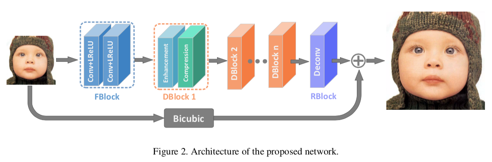

# IDN

This repository is implementation of the "Fast and Accurate Single Image Super-Resolution via Information Distillation Network".

<center></center>
<center></center>

## Requirements
- PyTorch
- Tensorflow
- tqdm
- Numpy
- Pillow

**Tensorflow** is required for quickly fetching image in training phase.

## Results

<table>
    <tr>
        <td><center>Original</center></td>
        <td><center>BICUBIC x2</center></td>
        <td><center>IDN x2</center></td>
    </tr>
    <tr>
    	<td>
    		<center></center>
    	</td>
    	<td>
    		<center></center>
    	</td>
    	<td>
    		<center></center>
    	</td>
    </tr>
</table>

## Usages

### Train

When training begins, the model weights will be saved every epoch. <br />
If you want to train quickly, you should use **--use_fast_loader** option.

```bash
python main.py --scale 2 \
               --num_features 64 \
               --d 16 \
               --s 4 \              
               --images_dir "" \
               --outputs_dir "" \               
               --patch_size 29 \
               --batch_size 16 \
               --num_epochs 20 \
               --lr 1e-4 \
               --loss "l1" \
               --threads 8 \
               --seed 123 \
               --use_fast_loader              
```

### Fine-tuning

The fine-tuning artifacts are generated as "IDN_ft_epoch_{}.pth".

```bash
python main.py --scale 2 \
               --num_features 64 \
               --d 16 \
               --s 4 \              
               --images_dir "" \
               --outputs_dir "" \
               --weights_path "" \               
               --patch_size 39 \
               --batch_size 16 \
               --num_epochs 20 \
               --lr 1e-5 \
               --loss "l2" \
               --threads 8 \
               --seed 123 \
               --use_fast_loader              
```

### Test

Output results consist of restored images by the BICUBIC and the IDN.

```bash
python example --scale 2 \
               --num_features 64 \
               --d 16 \
               --s 4 \              
               --weights_path "" \
               --image_path "" \
               --outputs_dir ""                              
```
